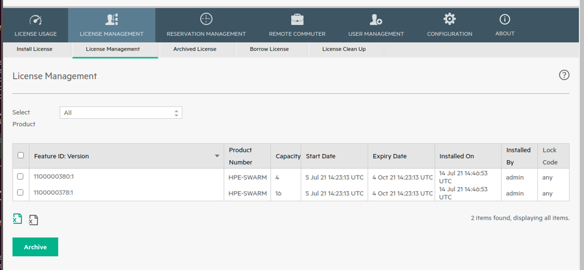

# How to setup Swarm Learning

The Swarm Learning package contains docker container images for each Swarm Learning component. The Swarm Learning container images are available in a docker registry as described in section [Pulling docker images](#pull-docker-images).

Create login credentials to access [My HPE Software Center (MSC)](https://myenterpriselicense.hpe.com/cwp-ui/evaluation/HPE-SWARM/0.3.0/null) if you don’t have yet. The email address used to access MSC is called as HPE passport account. 

The evaluation license for running the Swarm Learning components are available at [My HPE Software Center (MSC)](https://myenterpriselicense.hpe.com/cwp-ui/evaluation/HPE-SWARM/0.3.0/null). Use your HPE Passport account to access MSC and download evaluation license.

## Pulling docker images

Swarm Learning docker images are available on HPE docker registry - ``hub.myenterpriselicense.hpe.com.`` Docker registry access is password
protected. User needs to login to docker registry using HPE Passport email id and password 'hpe_eval'. All Swarm Learning images are signed by HPE with the name as 'hpe-ai-swarm-learning'. Users can inspect and pull these images after enabling docker content trust by setting the environment variable as 'DOCKER_CONTENT_TRUST=1'. See [Content trust in Docker](URL.md#21-content-trust-in-docker-httpsdocsdockercomenginesecuritytrust) for details.

The following Swarm Learning images are available on HPE docker registry:

1.  ``hub.myenterpriselicense.hpe.com/hpe_eval/swarm-learning/apls:0.3.0`` -- this is the docker image for the License Manager component.

2.  ``hub.myenterpriselicense.hpe.com/hpe_eval/swarm-learning/spire-server:0.3.0``-- this is the docker image for the SPIRE Server component.

3.  ``hub.myenterpriselicense.hpe.com/hpe_eval/swarm-learning/sn:0.3.0`` -- this is the docker image for the Swarm Network component.

4.  ``hub.myenterpriselicense.hpe.com/hpe_eval/swarm-learning/sl-tf:0.3.0``-- this is the docker image for the TensorFlow-based Swarm Learning component.

5.  ``hub.myenterpriselicense.hpe.com/hpe_eval/swarm-learning/sl-pyt:0.3.0``-- this is the docker image for the PyTorch-based Swarm Learning component.

6.  ``hub.myenterpriselicense.hpe.com/hpe_eval/swarm-learning/swci:0.3.0`` -- this is the docker image for Swarm Learning Command Interface component.

The steps to be followed to download Swarm Learning docker images on the Linux environment.
    
1. Use HPE Passport email id as username and 'hpe_eval' as password to login to registry
  
       docker login hub.myenterpriselicense.hpe.com -u <HPE-PASSPORT-EMAIL> -p hpe_eval

2. Enable docker content trust
     
       export DOCKER_CONTENT_TRUST=1

3. Optionally, inspect repos and validate HPE signer name for all the Swarm Learning images is ``hpe-ai-swarm-learning``
   For example
       
       docker trust inspect --pretty
       
       hub.myenterpriselicense.hpe.com/hpe_eval/swarm-learning/apls

  Sample output

    Signatures for hub.myenterpriselicense.hpe.com/hpe_eval/swarm-learning/apls
    
    SIGNED TAG   DIGEST                                                            SIGNERS
    
    0.3.0        4d889c26c9e583b0c0e394e8876047133ed6ce487188c88827c82451fdc75885  hpe-ai-swarm-learning
    
    List of signers and their keys for hub.myenterpriselicense.hpe.com/hpe_eval/swarm-learning/apls
    
    SIGNER                 KEYS
    
    hpe-ai-swarm-learning  cba8a8726e82
    
    Administrative keys for hub.myenterpriselicense.hpe.com/hpe_eval/swarm-learning/apls
    
    Repository Key:       26ec79d1aa6d2338ea7ab6ca498e46d1948e38e668cfa9899c7c4d1c8a23aa45
    
    Root Key:             43af4d638af9c5d0202318c951049719ce3f82181447c9f4f1c1bb6c02799f83

4. Pull all signed images with tag '0.3.0'

       docker pull hub.myenterpriselicense.hpe.com/hpe_eval/swarm-learning/apls:0.3.0
       
       docker pull hub.myenterpriselicense.hpe.com/hpe_eval/swarm-learning/spire-server:0.3.0
       
       docker pull hub.myenterpriselicense.hpe.com/hpe_eval/swarm-learning/sn:0.3.0
       
       docker pull hub.myenterpriselicense.hpe.com/hpe_eval/swarm-learning/sl-tf:0.3.0
       
       docker pull hub.myenterpriselicense.hpe.com/hpe_eval/swarm-learning/sl-pyt:0.3.0
       
       docker pull hub.myenterpriselicense.hpe.com/hpe_eval/swarm-learning/swci:0.3.0

## Installing licenses and starting license server

#### 1. Running AutoPass License Server (APLS)
 Start the APLS container using
``swarm-learning-install-dir/swarm-learning/bin/run-apls`` 

###### Access APLS Management console:  
Follow the steps mentioned below to browse APLS management console. 

> NOTE: For this explanation IP 192.168.1.102 is used – replace this IP address with the host system IP address on which the license server container is running. 
> 5814 is the default port used for APLS. 
   
Use a web browser to connect to APLS management console: https://192.168.1.102:5814/autopass.
> NOTE: Below instructions as is may or may not work in your local setup, you have to try relevant steps to browse APLS management console. 

- If you can run a browser on the host machine where you ran the "run-apls" script, You can now connect to the License server using https://192.168.1.102:5814/autopass from a browser. 
 
- Else, if the host machine is accessible from your laptop/desktop, then you can access by using https://192.168.1.102:5814/autopass from your laptop/desktop browser.

- Else you should setup SSH port forwarding first and then access https://localhost:5814/autopass from your laptop/desktop browser. 

> NOTE : Running below shell command is one of the way to do SSH port forwarding from your laptop/desktop.
> - $ ssh -L 5814:192.168.1.102:5814 username@192.168.1.102 

If the browser response is, "this site can’t be reached" / "refused to connect" - It means APLS is not running correctly. Restart run-apls script as mentioned above. 

For APLS management console login, the default username is "admin", and the password is "password".

   
#### 2. Setting up Swarm License

###### Download the License: 
If you don’t have Swarm License downloaded already, then get the License (.DAT file). 

Create login credentials to access [My HPE Software Center (MSC)](https://myenterpriselicense.hpe.com/cwp-ui/evaluation/HPE-SWARM/0.3.0/null) if you don’t have yet. The email address used to access MSC is called as HPE passport account. 

Use your HPE Passport account to access above MSC link and download evaluation license file.

###### Setup License: 

Use the management interface to install licenses and manage them. 

- See chapter "HPE AutoPass License Server License Management" in [AutoPass License Server User Guide](HPE%20AutoPass%20License%20Server%20User%20Guide.pdf) for details of the web GUI and how to install license.

###### (or) Following are quick steps: 

- Go to APLS management console. As described in step 1. 
- Go to License Management –> Install License
- Select License file (.DAT).
- Select all feature IDs and install. 

###### Confirm License setup is successful: 
Refer License installed picture here.

   
 
   If you are seeing the above screenshot in your APLS Management console, it means your license setup is complete. 

> NOTE: Whenever the container running the License Server (APLS) is stopped or the host system running the License Sever reboots, the  License Server needs to be started and the licenses have to be reinstalled again. 

### HPE recommends not to stop the License Server container once it is started.    

## Uninstalling the Swarm Learning package

Use the ``swarm-learning/bin/uninstall`` script to uninstall the Swarm Learning package. This script does not accept any command line parameters. It should be run on every node where Swarm Learning package was installed.

When run, it stops all Swarm Learning components that are running on that host, removes the docker container images, and deletes the "docs", "examples" and "scripts" directories installed under swarm-learning.

>NOTE: If needed, any log output produced by the containers should be saved before invoking the script as they will not be available     after the script is executed. Also output files that have been written under the "examples" directory by previous runs might also       require attention.
